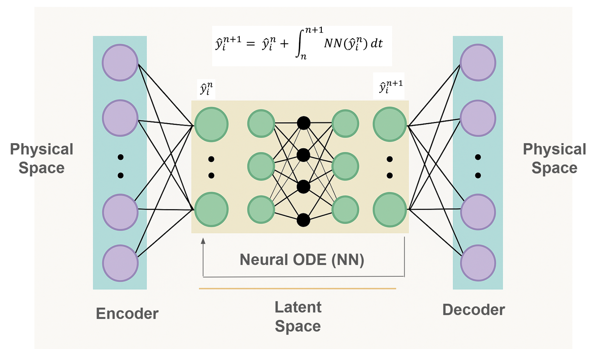
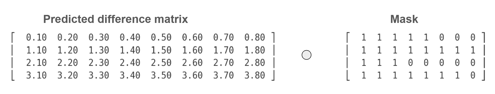
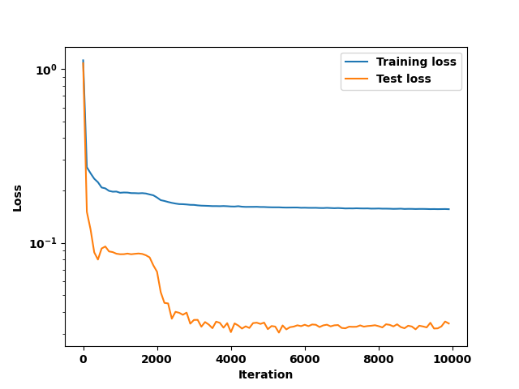
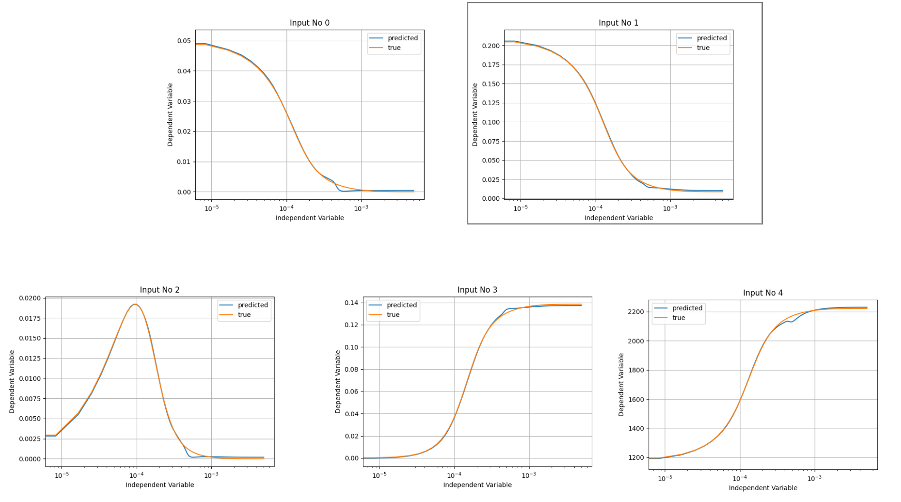
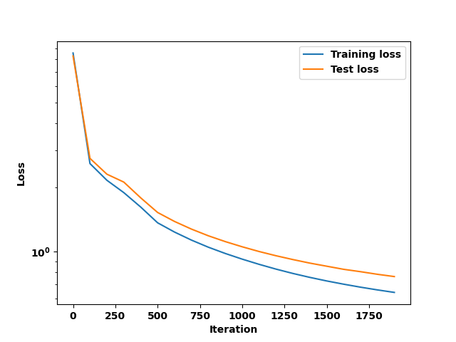
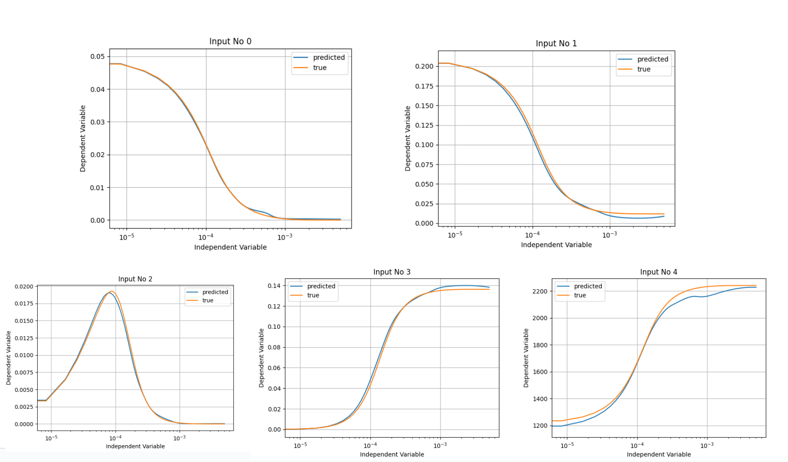
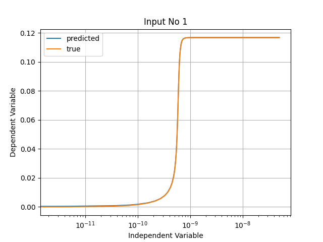
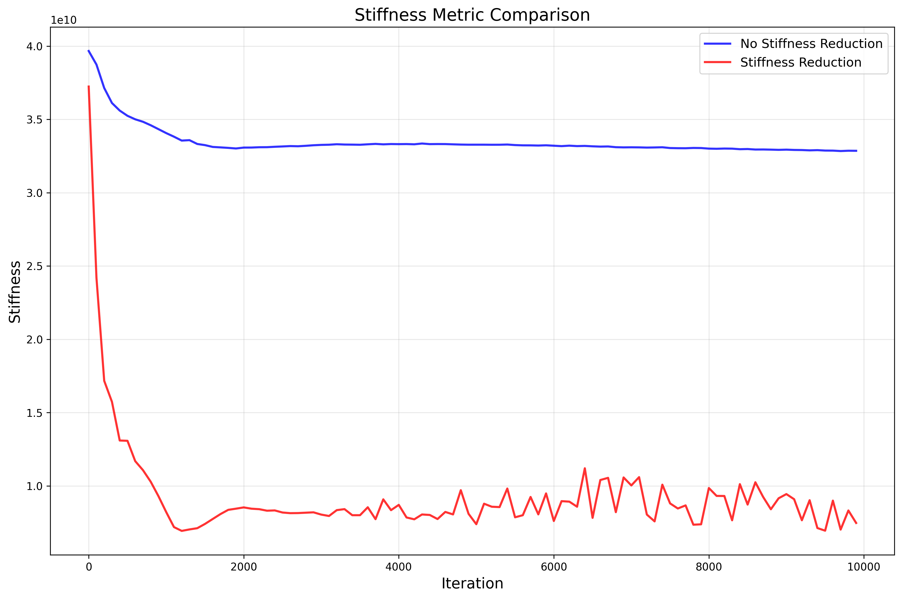
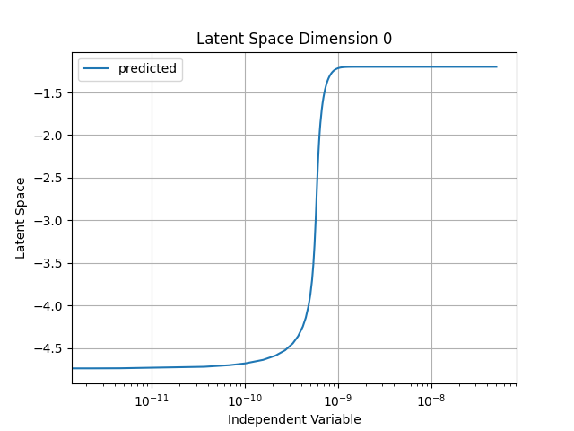
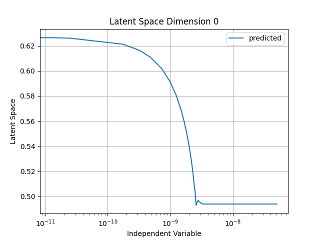

# Introduction

[](https://opensource.org/licenses/MIT)
[](https://www.python.org/downloads/)
[](https://github.com/google/jax)
[](https://github.com/patrick-kidger/diffrax)

Autoencoder Neural Ordinary Differential Equations (NODE) with dimension reduction and stiffness reduction for surrogate modeling of stiff and irregular time series data. This repository is a GPU-efficient open-source implementation of NODEs for irregularly sampled time series (with potentially different trajectory lengths) data with dimension reduction and stiffness reduction techniques.

# Value Proposition

 Modeling of irregularly-sampled time series data that may exhibit stiffness characteristics (for eg. multiple, order-of-magnitude different time scales of feature evolution) is an open and challenging problem. For example, hydrocarbon combustion models are a system of very stiff ODEs. The cost of solving these stiff ODEs at every node (measuring in millions) in a large simulation is prohibitive. A surrogate model that can accurately make predictions in a stiffness reduced manifold is exceptionally useful to use in place of the full equation system while simulating, reducing the cost of integration by order of magnitude.

Recent works have leveraged machine learning to create models that reduce the cost of solving these differential equations. In particular, Neural ODEs have been used in a wide variety of scientific applications, combining data driven modeling and scientific computing techniques. However, they are autoregressive models, and come with training challenges, from both a stability and efficiency perspective:

1.  They can be difficult to train on long time horizons, or on datasets with features exhibiting stiff behavior, as their rollouts can become unstable and diverge.

2. They are also nontrivial to effectively parallelize on a GPU, given their autoregressive nature. 

# Installation

Clone this repo:

```
git clone git@github.com:Saakaarb/AE-NODE-StiffnessReduction.git
```

And then create a virtual env, and activate it:

```
python/python3 -m venv venv
source venv/bin/activate
```

Finally, install the requirements

```
pip install -r requirements.txt
```

# Key Features

1. Encoder-NODE-Decoder architecture: The integration in time is transformed to a reduced-dimension latent space via an encoder-decoder architecture. The time integration is then performed by the NODE. This improves the training effectiveness of the NODE. The NODE is trained to integrate the latent, stiffness reduced system using explicit integration schemes. 

<p align="center">
  
</p>

2. A stiffness reduction regularization can be used while training the encoder-decoder, to reduce the stiffness of the latent space. This enables lower cost integration in the latent space as larger steps can to be taken. The methodology is adapted from [3]. In summary, for a latent space z the following regularization term is added to the encoder-decoder training:

```math
R([z_0 \dots z_T], [t_0 \dots t_T]) = \bar{\kappa}(P) = \frac{1}{T - 2} \sum_{t=1}^{T-1} \frac{\left\lVert \delta \frac{dz}{dt} \right\rVert}{\lVert \delta z \rVert}
```

where

```math
\left\lVert \delta \left( \frac{dz}{dt} \right) \right\rVert =
\left\lVert
\left( \frac{z_{t_{i+1}} - z_{t_i}}{t_{i+1} - t_i} \right)
-
\left( \frac{z_{t_i} - z_{t_{i-1}}}{t_i - t_{i-1}} \right)
\right\rVert
```

```math
\lVert \delta z \rVert = \lVert z_{i+1} - z_{i-1} \rVert
```

3. Effective GPU utilization: The framework efficiently can handle staggered trajectories (trajectories of unequal length) on GPU, as it is common in many applications involving time series data to have staggered, non-uniformly sampled trajectories. This is done by a combination of masking and vectorizing strategies to reduce memory latency, H2D transfers and maximize GPU occupancy. Shown below is an example of using a mask to remove extra predictions on irregularly sampled, non uniform trajectories; the hadamard product of the two ensures physicality while allowing vectorization.

<p align="center">
  
</p>


4. Can be used on time series data in any timescale range (nanoseconds to seconds); utilizes several scaling and normalization tricks and conventions, some of which are discussed in [5].

5. Built on well documented, standard libraries. These include
  - [Diffrax](https://docs.kidger.site/diffrax/) for training Neural ODEs
  - [Equinox](https://docs.kidger.site/equinox/) for setting up neural networks
  - [Optax](https://optax.readthedocs.io/en/latest/index.html) for running training network training
  -  [MLFlow](https://mlflow.org/) tracking of experimental settings, results and artifacts. 

# Getting Started

To demonstrate the utility of the framework, we will create a model that learns to autoregressively predict the results of a hydrocarbon combustion process, for a range of initial temperatures and fuel mass fractions. The reaction under consideration is a 2 step combustion of a methane-like fuel F:

1. **Fuel oxidation:**  
   ```math
   \mathrm{F} + 1.5\ \mathrm{O_2} \ \xrightarrow{k_1}\ \mathrm{CO} + 2\ \mathrm{H_2O}
   ```
   ```math
   k_1 = A_1 e^{-E_1/(RT)},\quad A_1 = 1.0\times 10^6\ \mathrm{s^{-1}},\quad E_1 = 6.0\times 10^4\ \mathrm{J\,mol^{-1}}
   ```

2. **CO oxidation:**  
   ```math
   \mathrm{CO} + 0.5\ \mathrm{O_2} \ \xrightarrow{k_2}\ \mathrm{CO_2}
   ```
   ```math
   k_2 = A_2 e^{-E_2/(RT)},\quad A_2 = 5.0\times 10^5\ \mathrm{s^{-1}},\quad E_2 = 4.0\times 10^4\ \mathrm{J\,mol^{-1}}
   ```

We will consider the following ranges of initial conditions:

```math
Y_{F,init}=[0.03,0.1]
Y_{Temp,init}=[1100,1300] K

```

The initial mass fractions of air and other components are adjusted to account for this.

## Step 1: Training Data

The training data is in tutorial/tutorial_data. It is in row_major format. The first row is (and always has to be) time, and every other row is a feature that can be used  Sample is shown below:

```
0.000000000000000000e+00,8.347245409015025696e-06,1.669449081803005139e-05, ..... 
5.621780831931537381e-02,5.309955140219043551e-02,4.986923398327756940e-02, ..... 
2.099999999999999922e-01,2.004625121967271439e-01,1.901642741624996469e-01, ..... 
0.000000000000000000e+00,5.084576623539984776e-03,9.620111670793017253e-03, ..... 
0.000000000000000000e+00,5.667543360302558552e-04,2.303644030980522492e-03, ..... 
1.290142861281983187e+03,1.330740917367549628e+03,1.376281295596508699e+03, ..... 
```

## Step 2: Configuration file

The config file is in tutorial/tutorial_config.yml. It has been set up to run easily.

## Step 3: Running the training

To run the training, run the following command:

```
python driver_script -c "tutorial/tutorial_config.yml" # specify config file location
```
## Step 4: Results 

The model is trained in 2 stages. First, the encoder-decoder is trained, then the neural ODE is trained keeping the weights of the encoder-decoder frozen.

After the training is complete, the training curves and resulting predictions can be visualized. The code logs all metrics and artifacts through MLFlow for later use. Shwon below is an example training curve for encoder-decoder loss. **The training loss is much higher than test loss because it includes the stiffness reduction term**

<p align="center">
  
</p>

We can visualize how effectively the encoder-decoder is able to encode the physical space in the latent space, by passing a test point through the encoder-decoder architecture and comparing to the truth:

<p align="center">
  
</p>

Once the NODE training is complete, we can visualize it's training loss:

<p align="center">
  
</p>

We can again visualize the autoregressive predicted trajectory for a test point. The predictions are somewhat off for some of the features; this can be improved by a hyperparameter sweep, longer training, and more strategic sampling of data (currently, the data is randomly sampled). The script to generate the data is present in /tutorial

<p align="center">
  
</p>

## Stiffness Reduction

A critical feature of this repository is the stiffness reduction technique discussed in previous sections. To demonstrate this capability, a more stiff problem is considered:

This script models two parallel exothermic combustion reactions using Arrhenius kinetics:

1. **Methane oxidation (complete combustion):**

```math
\mathrm{CH_4 + 2\,O_2 \;\;\rightarrow\;\; CO_2 + 2\,H_2O}
```

with rate expression:

```math
r_1 = A_1 \, e^{-E_{a1}/(RT)} \,[\mathrm{CH_4}] \,[\mathrm{O_2}]^2
```

---

2. **Hydrogen oxidation:**

```math
\mathrm{H_2 + \tfrac{1}{2}\,O_2 \;\;\rightarrow\;\; H_2O}
```

with rate expression:

```math
r_2 = A_2 \, e^{-E_{a2}/(RT)} \,[\mathrm{H_2}] \,[\mathrm{O_2}]
```

---

- \( \mathrm{N_2} \) is treated as inert.  

This system is much stiffer; this can be seen by the solution time scale:

<p align="center">
  
</p>

On running an experiment with and without the stiffness regularization discussed above for this experiment, we can plot this and see the value of the stiffness approximation metric:

<p align="center">
  
</p>


The corresponding latent space solution can be plotted with time, and it is easy to see that it is possible in the right case for an ODE integrator to take larger steps, since the solution changes more slowly with time, compared to the left case.

<p align="center">
  
  
</p>


# Best Practices

Listed below are some best practices to avoid pitfalls for training Neural ODEs, using this framework or in general:

1. Train the encoder-decoder to as low an error as possible; incorrect encoder-decoder predictions cause NODE training  to fail quickly.

2. You have the option of selecting which rows/columns to include in the training set. Make sure all features 
   that are causative are included in the training data. For example, if modeling a chemical reaction, by not including the temperature, the network cannot learn the appropriate cause effect relationships from data and this will result in a poor model.

3. Do not have long tails in training trajectories where no "kinetics" or actions occur. For example, while simulating a combustion reaction, for every training trajectory if the reaction is complete in a maximum of ~10^(-4) seconds, do not use data lasting upto 10^(-2) seconds. This creates a long tailed trajectory where the NODE must learn to predict 0 (which it does not do effectively) and also reduces the effectiveness of critical scaling tricks borrowed from [5]. (add images)

4. If the system timescale is very small (max time < 10^(-7)), always use fp64 training (set in config: neural_ode.training.precision) instead of fp32. This is because of a (current) known issue in diffrax (issue #660). If the time scale of the system are larger, use fp32 for faster, more efficient training.

5. When training the encoder-decoder with stiffness reduction, play around with the value of the stiffness reduction coefficient by observing the relative magnitude of "test error" and "test cond loss" printed while training. "test error" and "stiffness_reduction_weight*test_cond_loss" should be roughly the same O.O.M for effective training.

6. Try and make key hyper-parameters a power of 2. Key ones include network widths, samples per batch. This allows for more optimum GPU training.

# Acknowledgements

This repo leverages techniques, ideas and APIs from the following works:

1. [ChemNODE: A neural ordinary differential equations framework for efficient chemical kinetic solvers](https://www.sciencedirect.com/science/article/pii/S2666546821000677)

2. [A data-driven reduced-order model for stiff chemical kinetics using dynamics-informed training](https://www.sciencedirect.com/science/article/pii/S2666546823000976)

3. [Stiffness-Reduced Neural ODE Models for Data-Driven Reduced-Order Modeling of Combustion Chemical Kinetics](https://arc.aiaa.org/doi/abs/10.2514/6.2022-0226)

4. [A Physics-Constrained Autoencoder-NeuralODE Framework for Learning Complex Hydrocarbon Fuel Chemistry: Methane Combustion Kinetics](https://www.frontiersin.org/journals/thermal-engineering/articles/10.3389/fther.2025.1594443/abstract)

5. [Stiff Neural Ordinary Differential Equations](https://arxiv.org/abs/2103.15341)

6. [Neural Ordinary Differential Equations](https://arxiv.org/abs/1806.07366)

7. [On Neural Differential Equations](https://arxiv.org/abs/2202.02435)

# Directory Structure

The directory structure of this repo. Some other dirs may be created during running, depending on user provided paths.

```
AE-NODE-StiffnessReduction/
├── config/                 # Configuration files
├── img/                    # Images and figures
├── logs/                   # Training and execution logs
├── mlruns/                 # MLFlow experiment tracking
├── src/                    # Source code
│   ├── lib/               # Core library modules
│   │   ├── autoencoder/   # Autoencoder implementation
│   │   ├── data_processing/ # Data handling and preprocessing
│   │   └── NODE/         # Neural ODE implementation
│   └── utils/             # Utility functions and helpers
├── tutorial/               # Tutorial examples and configurations
├── driver_script.py        # Main execution script
├── README.md              # This documentation file
└── requirements.txt        # Python dependencies
```

# Improvements to come

- Further GPU optimization
- Tests
- Scaling of latent space inputs
